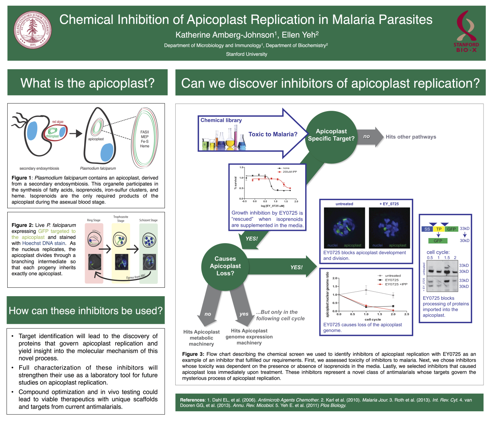

Starting with ~400 compounds including common antibiotics and compounds from the Malaria Box, we designed a cell-based screen to identify small molecules that inhibited Plasmodium falciparum plastid organelle biogenesis.

Through collaboration with medicinal chemist at Stanford and at other universities, we performed structure-activity relationship experiments to successfully identify more potent and specific small molecule inhibitors.
