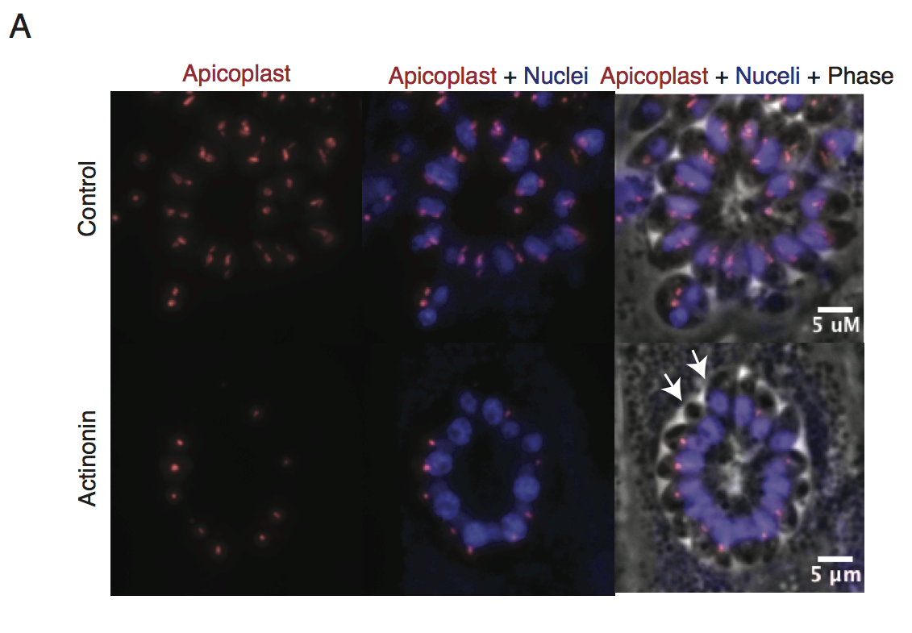
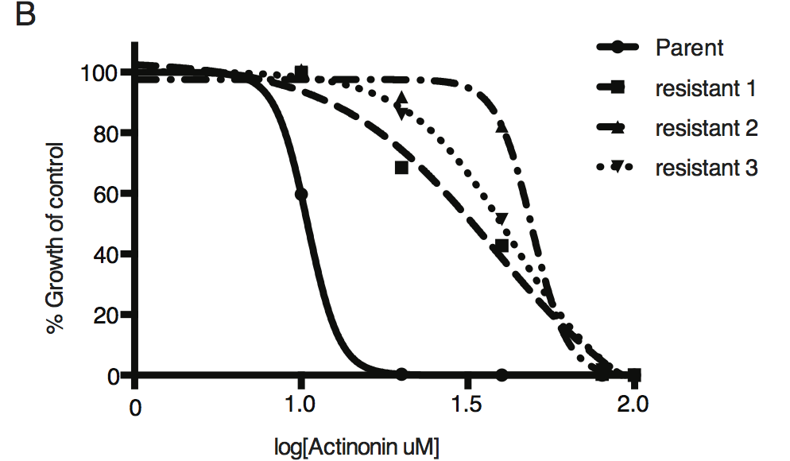
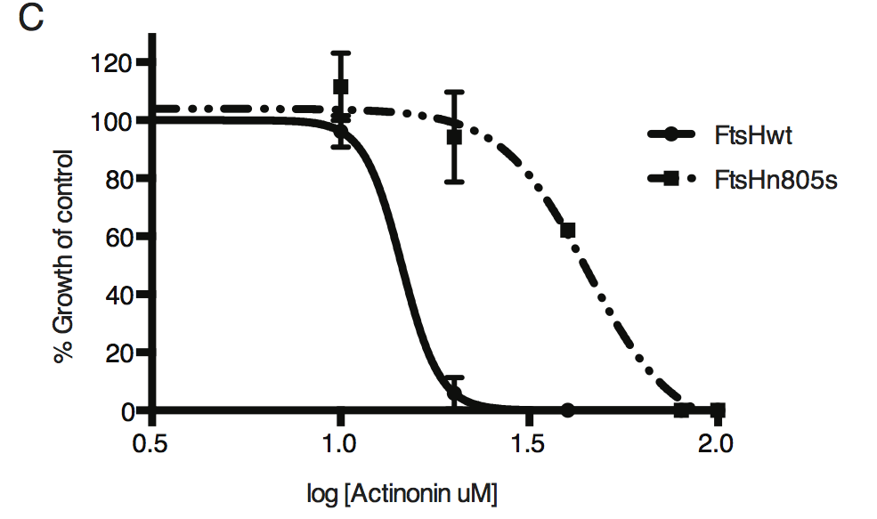
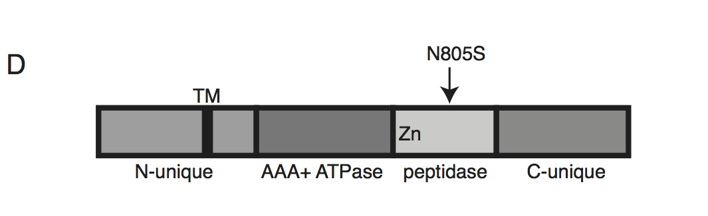
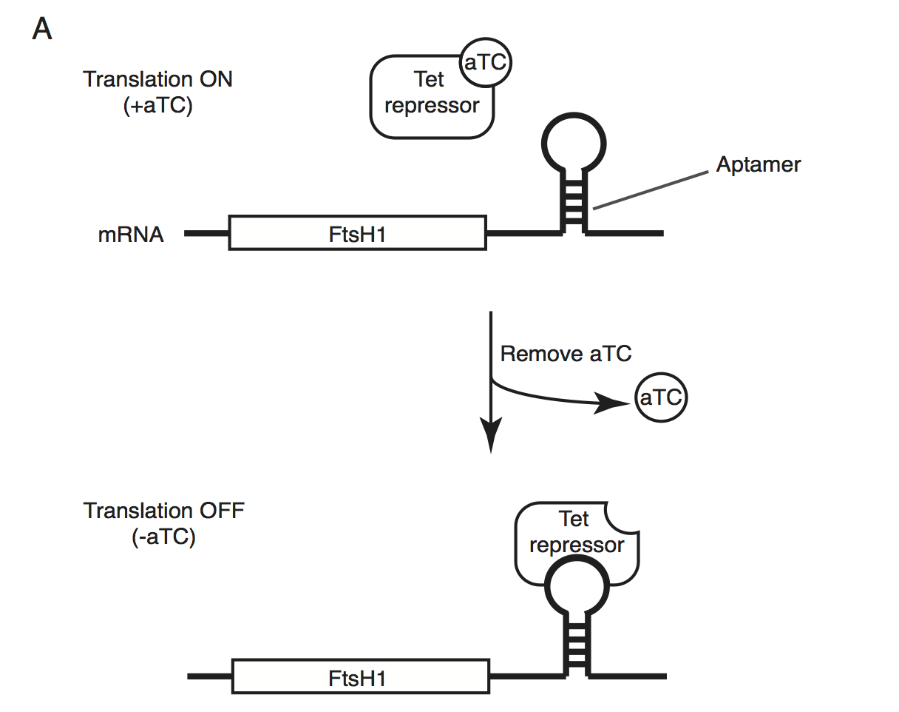
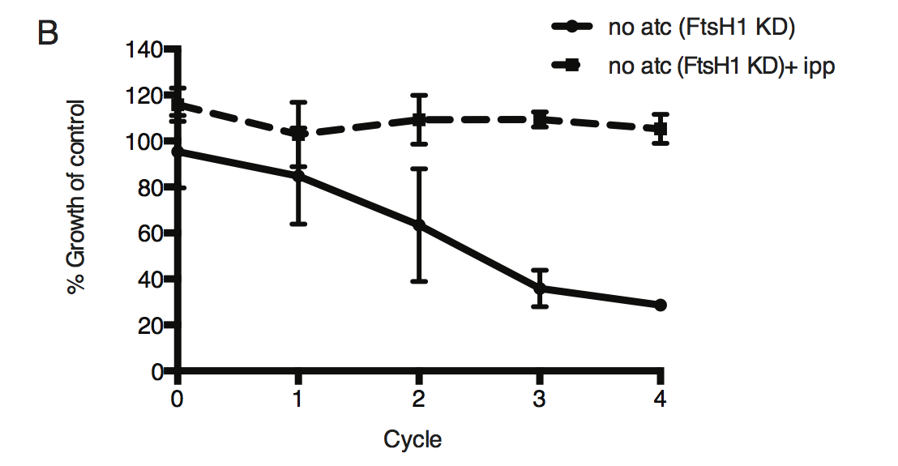
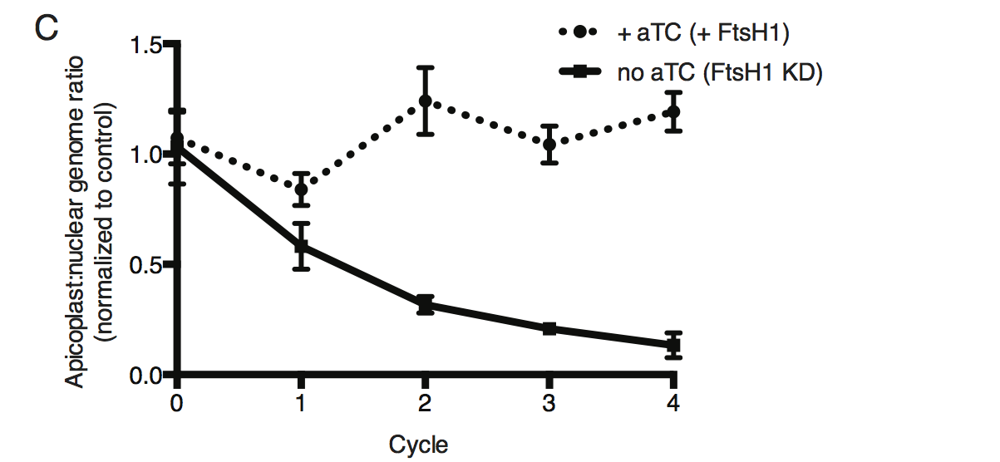
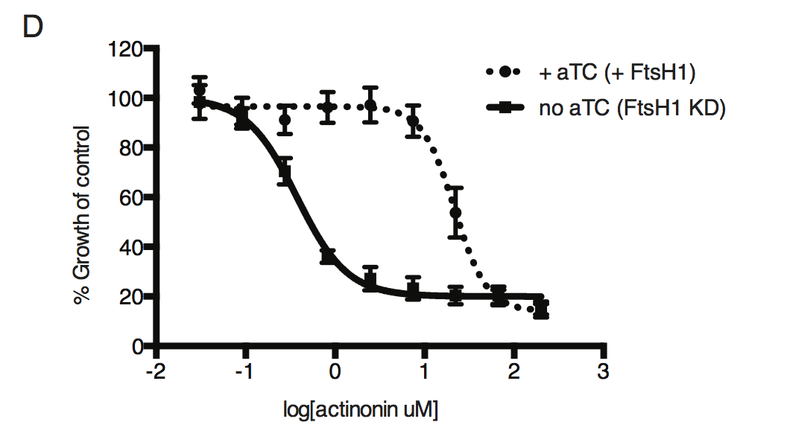

To identify the target of actinonin, we initially  attempted to isolate actinonin-resistant P. falciparum but failed using multiple selection methods, including chemical mutagenesis, that successfully selected resistance against other compounds. Therefore, we turned to Toxoplasma gondii, a related apicomplexan parasite, which contains an apicoplast of the same evolutionary origin, because it is easier to grow to large numbers and to genetically modify. 

Because actinonin disrupted apicoplast biogenesis in both T. gondii and P. falciparum, suggesting a common target, we selected actinonin-resistant T.gondii and submitted resistant strains for whole-genome sequencing. Five out of eight independently selected clones contained a single point mutation in FtsH1, an apicoplast membrane metalloprotease. To validate FtsH1 as the genetic mechanism of resistance, we replaced the endogenous FtsH1 locus with either a wild-type or mutant FtsH1 locus. The mutated FtsH1 strain resulted in resistance, strongly suggesting FtsH1 as the target of actinonin. 

Lastly, we validated FtsH1 as the target of actinonin in P. falciparum. Using a FstH1 knock-down line, we  down-regulated FtsH1 expression and observed a 58-fold decrease in the actinonin EC50 upon knockdown of FtsH1 expression. To confirm that actinonin bound directly to FtsH1, we expressed and purified FtsH1 in vitro and found that actinonin inhibited protease activity of purified FtsH1. 

### A mutation in the protease domain of ftsH1 is sufficient to confer resistance to actinonin in <em>T. gondii</em>

  
  
Representative images of the apicoplast of control and actinonin treated parasites 36 hours after infection. The apicoplast is visualized using the T. gondii reporter strain RH FNR-RFP in which RFP is targeted to the apicoplast and the nucleus is stained with Hoescht 33342. Each parasite contains one apicoplast, except during cell division when there may be two. White arrows point at examples of T. gondii parasites missing an apicoplast.

  
  
Dose-dependent parasite growth inhibition upon treatment with actinonin for the actinonin-sensitive parent strain (RH) compared with 3 independent clones following selection for actinonin resistance (resistant 1, resistant 2, resistant 3). These three resistant clones are representative of the eight clones submitted for whole genome sequencing. Growth was measured via summed areas of the plaques formed during plaque assays and normalized to untreated controls. Error bars represent the SEM of two biological replicates.

  
  
Dose-dependent parasite growth inhibition upon treatment with actinonin for ftsH1WT compared with ftsH1(N805S) parasites in RH Δku80 strain. Data was measured and analyzed as in B. 

  
  
 Schematic of TgFtsH1. This protein contains a N-unique region containing a putative transmembrane domain, an AAA ATPase domain used for unfolding proteins, a peptidase domain with a zinc co-factor in the catalytic site, and a C-unique region. The resistance-conferring variant FtsH(N805S) is found in the peptidase domain near the catalytic site. 

### Knockdown of ftsH1 in <em>P. falciparum</em> leads to apicoplast loss and hypersensitivity to actinonin

  
  
Schematic of the endogenous knockdown strategy. When aTC is present in the media, the tet-repressor binds aTC and does not bind the 10x-aptamer sequence, which relieves translational repression, allowing PfFtsH1 to be expressed. When aTC is washed out of the media, the tet-repressor binds the 10x-aptamer and prevents expression of PfFtsH1.

  
  
Time course of parasite growth without aTC and in the presence or absence of IPP in the media, normalized to the untreated or IPP-rescued parental strain as appropriate. Error bars represent the SEM of two biological replicates.

  
  
Time course of the apicoplast:nuclear genome ratio measured by quantitative PCR (qPCR) using primers for the apicoplast and nuclear genomes during treatment with or without aTC. All samples contained IPP to rescue parasite growth. Genome ratios were normalized to respective parental cultures also grown with IPP. Error bars as in C. 

  
  
 Dose-dependent parasite growth inhibition by actinonin in the absence or presence of aTC. Error bars as in C. 

