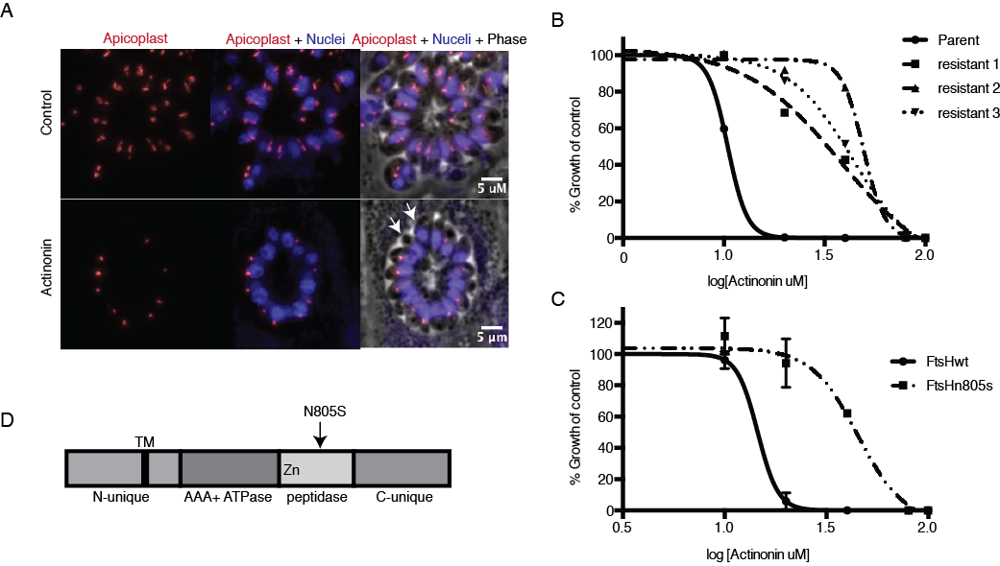
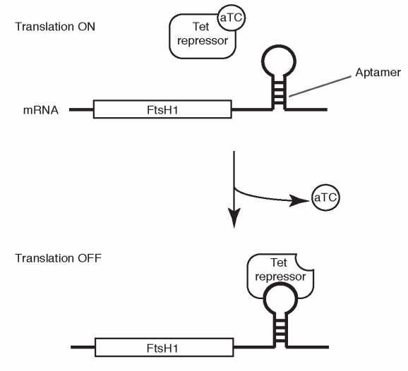
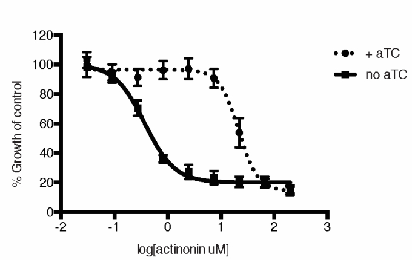

To identify the molecular target of actinonin, we selected resistant mutants in Toxoplasma gondii that could survive high amounts of drug. Resistant mutants had a point mutation in FtsH, a plastid membrane metalloprotease, that was sufficient to confer resistance.

To verify that FtsH was also the target of actinonin in Plasmodium falciparum, we used an inducible knock-down strain, in which expression of FtsH could be controlled by the presence of a small molecule, anhydrotetracycline (atc). After knock-down of FtsH in P. falciparum, parasites were 50-fold more susceptible to actinonin, strongly suggesting that FtsH is the target of actinonin in P. falciparum. 

