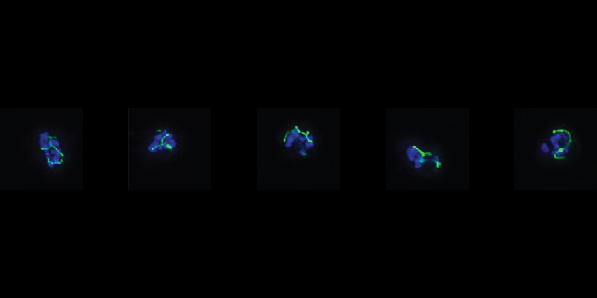

As an essential and parasites-specific organelle, the apicoplast is a desirable drug target. In fact, both doxycycline and clindamycin, inhibitors of the apicoplast ribosome, block apicoplast biogenesis and are used clinically for Plasmodium falciparum chemoprophylaxis and as a second-line therapy for Toxoplasma gondii acute infections. In addition to apicoplast ribosome inhibitors, inhibitors of apicoplast DNA gyrase (ciprofloxacin) and apicoplast membrane protease FtsH1 (actinonin) have also been previously described to block apicoplast biogenesis. 

Despite the importance of apicoplast biogenesis inhibitors, how the mechanism of the inhibitors relates to the timing of parasite death and apicoplast loss still remains poorly understood. 

  

     
  

  

  Apicoplast biogenesis inhibition
  

  
