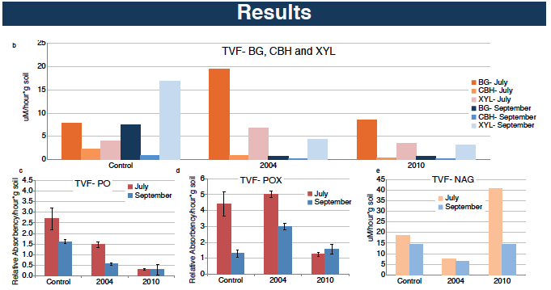

In the summer of 2011, I participated in a 10-week internship at Lawrence Berkeley National Laboratory through the Science Undergraduate Laboratory Internship (SULI) program. Working under the supervision of Professor Janet Jansson, Environmental Microbiology Program Lead, and post-doctoral researcher Neslihan Tas, we studied the effect of wildfire on Alaskan Boreal Forest Soils. By performing sequential enzymatic activity assays on soils collected at incremental years after a wildfire event, we were able to study trends in activity. We assayed for cellulases, chitinases, and oxidases to test microbial enzymatic plant degradation.

Soil microbes have an important role in the global carbon cycle. They contribute to the degradation of plant material and emit CO2 fixed by plants back to the atmosphere. The activity of extracellular enzymes that allow them to decompose organic plant material may vary depending on the conditions of the soil environment. Wildfires, for example, change the soil structure and chemistry. Moreover, in places such as the northern boreal forests they are expected to increase in frequency and severity due to global climate change.

This research measured the activity of several enzymes involved in degradation of plant material; namely cellulases, oxidases and chitinases, in soils affected by wildfires in Alaskan boreal forests. Top soils from five wildfire and control locations were collected in July and September 2010. Activity of enzymes were tested on the basis of their ability to cleave a model substrate (i.e. 4-methylumbelliferone) or degrade a dedicated substrate such as L-3,4-dihydroxyphenylalanine.

Overall, the control soils had the highest amount of activity of the cellulases, compared to corresponding post-fire sites in most of the sites tested. These enzymes also had lower activity in soils from recent wildfire events compared to their activity in soils from earlier wildfire events. Phenol oxidase followed this trend, however in some cases the activity of phenol peroxidase diverged. The chitinase activity differed depending on the location from which the sample was collected. The overall enzymatic activity differed depending the season and location from which it was collected. These results indicate that an aspect of wildfire is suppressing the activity of cellulases and oxidases in the soil, and the magnitude of the effect is highly variable, depending on the soil’s location and season of origin.

Please see my [poster](../resources/suli-poster.pdf) and [paper](../resources/suli-paper.pdf) for more information.

